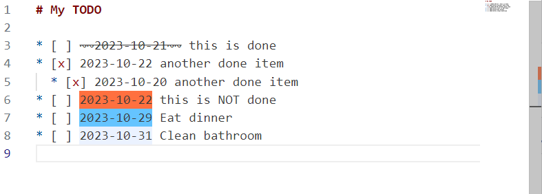

# date-highlighter README

## Features

The extension will highlight dates in the form of "yyyy-mm-dd" and apply highlights. It's useful for organizing your TODOs in a plain text or markdown file.

There is a very rudimentary "doneness" check to not highlight items that are done. 

* `~~` immediately preceding the dates
* Any `[x]` preceding the dates in the same line

## Extension Settings

This extension contributes the following settings:

* `datehighlighter.onlyHighlightGlob`: Array of of glob strings that match file paths to limit highlighting. See [glob patterns](https://code.visualstudio.com/docs/editor/glob-patterns) for reference.

This extension contributes the following color settings (Place it under `workbench.colorCustomizations`):

* `wbk.datehighlighter.overdueBackground`: background color for overdue dates.
* `wbk.datehighlighter.todayBackground`: background color for today's date
* `wbk.datehighlighter.futureBackground`:  background color for future dates

## Known Issues / Requests

* The highlighting is done using decorators, so there is some delay after you type the text.
* It does not use a very performant method to match dates. Don't use it with big files.

You could file requests [here](https://github.com/wbkang/vscode-ext-date-highlighter/issues)

## Release Notes

Users appreciate release notes as you update your extension.

### 0.0.1

Initial release.

### 0.0.2

Fix some NPEs.

### 0.0.3

Correct extensionKind.
---

## Following extension guidelines

Ensure that you've read through the extensions guidelines and follow the best practices for creating your extension.

* [Extension Guidelines](https://code.visualstudio.com/api/references/extension-guidelines)
